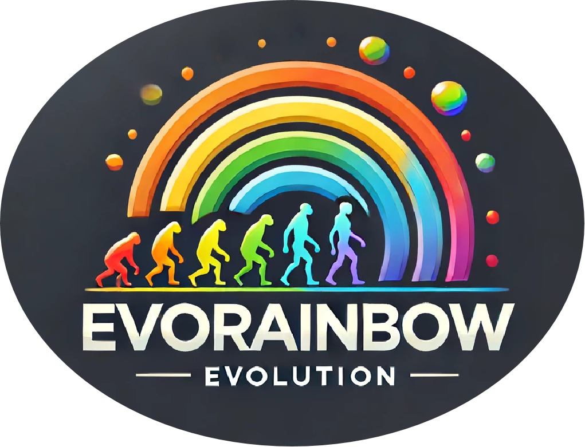

<p align="center">
    <br>
    
    <br>
<p>
  
# 🌈 EvoRainbow: Combining Improvements in Evolutionary Reinforcement Learning for Policy Search
(ICML 2024) The official code for EvoRainbow: Combining Improvements in Evolutionary Reinforcement Learning for Policy Search

<p align="center">
    <br>
    
    <br>
<p>

EvoRainbow integrates the latest advancements in ERL methods for policy search. Specifically, EvoRainbow contributes as follows:

- :trident: Decomposes ERL methods into five perspectives, where all current ERL for policy search work can be seen as combinations of these five aspects.
- :bar_chart: Analyzes different mechanisms within each aspect across tasks with diverse characteristics, identifying the most efficient mechanisms.
- :performing_arts: Integrates the most effective mechanisms into EvoRainbow and EvoRainbow-Exp.
- :key: EvoRainbow expands the testing domain of current ERL beyond MUJOCO tasks, advocating for researchers to focus on tasks with various other characteristics.
- :trophy: EvoRainbow achieves the best performance in the field of ERL for policy search across various tasks.

For more detailed information, please refer to [our paper](https://openreview.net/forum?id=75Hes6Zse4).

> [!TIP]
> 🔥 🔥 🔥 If you are interested in ERL for policy search or other hybrid algorithms combining EA and RL, we **strongly recommend** reading our survey paper: [Bridging Evolutionary Algorithms and Reinforcement Learning: A Comprehensive Survey on Hybrid Algorithms](https://arxiv.org/abs/2401.11963). It provides a comprehensive and accessible overview of research directions and classifications suitable for researchers with various backgrounds.


EvoRainbow = Parallel Mode + Shared Architecture + CEM + Genetic Soft Update + H-Step Bootstrap with Critic. 
EvoRainbow-Exp = Parallel Mode + Private Architecture + CEM + Genetic Soft Update.
Our repository primarily provides the implementation codes for EvoRainbow and EvoRainbow-Exp on MUJOCO and Metaworld. We will consider releasing the code for other environments in the future.


## 🙏 Citation

If you do find our paper or the repository helpful (or if you would be so kind as to offer us some encouragement), please consider kindly giving a star, and citing our paper.
```

@inproceedings{lievorainbow,
  title={EvoRainbow: Combining Improvements in Evolutionary Reinforcement Learning for Policy Search},
  author={Li, Pengyi and Zheng, Yan and Tang, Hongyao and Fu, Xian and Jianye, HAO},
  booktitle={Forty-first International Conference on Machine Learning}
}


```


## 🛠️ Instructions


You need to create a [Weights & Biases](https://wandb.ai) account for visualizing results, and you should already have conda and MUJOCO installed.

Different benchmarks require different versions of libraries, so we recommend constructing different environments based on the specific benchmarks.

First, select the task you want to experiment with. If it's a MUJOCO task, navigate to the MUJOCO directory by running `cd ./MUJOCO`. If it's a Metaworld task, navigate to the Metaworld directory by running `cd ./MetaWorld`.

Then, we create the conda environment based on the provided 'environment.yml':

```
conda env create -f environment.yml
```

Note: Modify the `name` field in the `environment.yml` file to change the environment name to your desired name.

Activate the environment:

```
conda activate env_name
```

The `env_name` refers to the name of the conda environment you create.

Then directly run 'run.sh'. We recommend checking the commands inside the `run.sh` file as it uses `nohup`. If you want to run it directly, please remove the `nohup` related instructions.
```
chmod 777 ./run.sh
./run.sh
```

The specific hyperparameter settings need to be adjusted according to the original paper.


## :beginner: License & Acknowledgements

EvoRainhow is licensed under the MIT license. We use the implementations of other open-source ERL algorithms, including [ERL](https://github.com/ShawK91/Evolutionary-Reinforcement-Learning)
[PDERL](https://github.com/crisbodnar/pderl), [CEMRL](https://github.com/apourchot/CEM-RL), [PGPS](https://github.com/NamKim88/PGPS), and [ERL-Re$^2$](https://github.com/yeshenpy/ERL-Re2).

## ✉ Contact

For any questions, please feel free to email `lipengyi@tju.edu.cn`.


